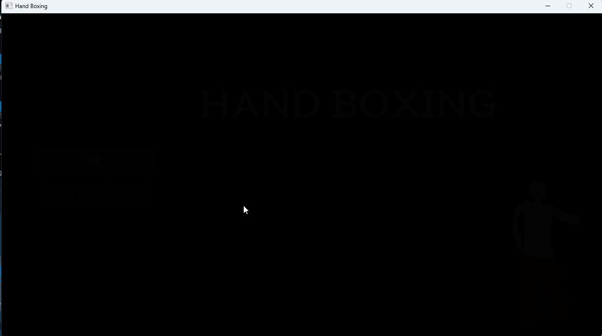
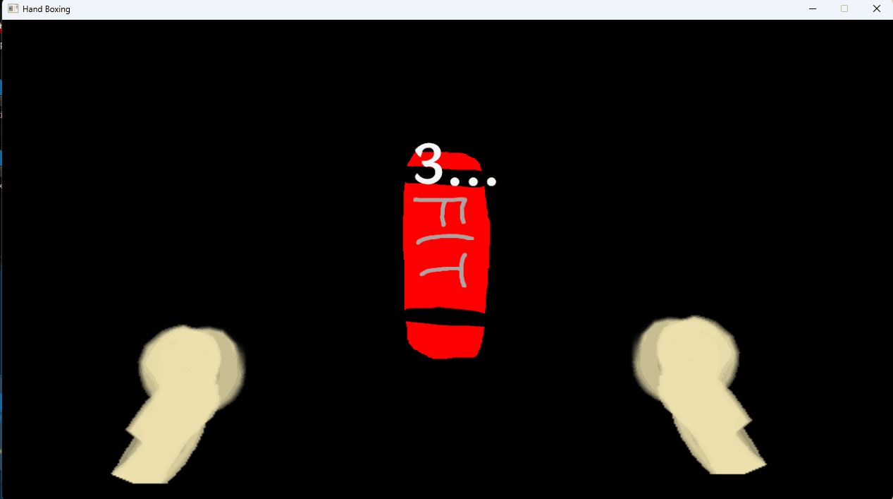

[itch.io](https://hyuckkim.itch.io/handboxing)
[github](https://github.com/hyuckkim/hand-boxing)

자작 엔진 + lua 게임.

마우스를 여러 개 사용할 수 있게 됐으면 당장 뭐부터 만들어야 할까?  
내 선택은 복싱이었다.
왼손에 하나 오른손에 하나.

마우스의 궤적이 그대로 손이 된다.

  
마우스 인식을 위해서 몇 가지 동작을 취해보는 걸 구현했다.

  
동그라미 파티클과 화면 흔들림 효과를 적용했다.

## 사족
유니티에서 마우스 분리를 해 주는 라이브러리가 없어서 자작 엔진에 기능 넣어서 만들었었는데,
[인공지능한테 시키니까 5분만에](https://gist.github.com/hyuckkim/ddd3afe42870aa6635df492aa7821aee)
만들어 줬다...

이 프로젝트 자체도 인공지능 가득이기도 하고.

+) 내가 검색을 못 했을 뿐이고 이미 [만들어진 게](https://github.com/jackyyang09/Multi-Mouse-Unity)
있기도 하네...  
앞으로는 진짜 검색 좀 잘하고 다니자